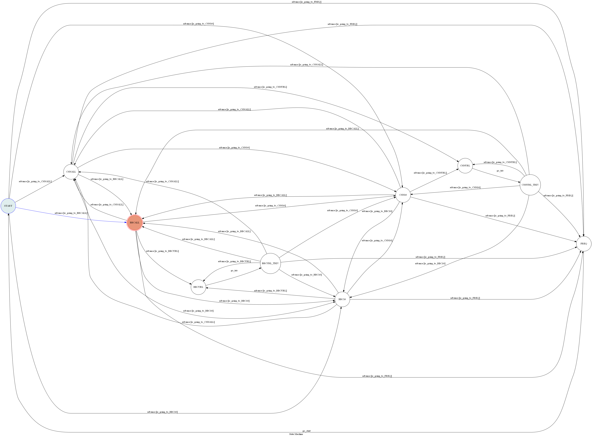

# TOC Project 2017

### Run Locally
You can either setup https server or using `ngrok` as a proxy.

**`ngrok` would be used in the following instruction**

```sh
ngrok http 5487
```

After that, `ngrok` would generate a https URL.

You should set `WEBHOOK_URL` (in app.py) to `your-https-URL/hook`.

#### Run the sever

```sh
python app.py
```

## Finite State Machine


## Usage
The initial state is set to `START`.

Input "CNN" : the bot replys the news titles parsed from on http://edition.cnn.com with indices.
Input "CNN10" : the bot replys the first 10 news titles parsed from http://edition.cnn.com with indices.
So do inputting "BBC" and "BBC10". (source: http://www.bbc.com/news)

Then the user can get a news URL by inputting the index of a news title.

Input "Freq" : the bot replys the top 10 frenquent words in the CNN titles, BBC titles, overall, respectly.